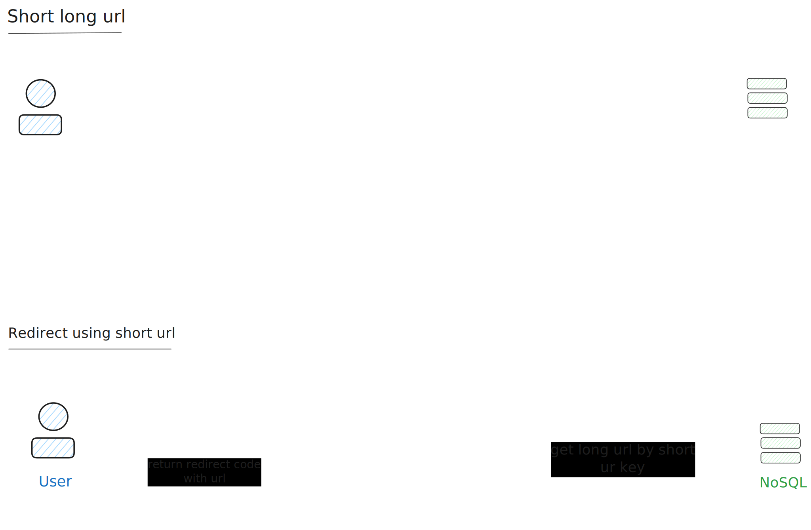

<h1 align="center">SHORTENER </h1>
<h3 align="center">


<br>


</h3>
<br>

# Description 📢

This project is a URL shortening service built with Astro for the frontend, Spring Boot for the backend, and MongoDB and Redis for data storage and caching. The entire project is containerized using Docker, and Docker Compose is used to manage the multi-container application.

<br>

# Uses Cases 👤

- **Short long urls**: Users can shorten long URLs into easily shareable, concise links.
- **Redirect urls**: Users can redirect to long URLs from shortened URLs.

The following diagram shows the high-level architecture of the project:



<br>


# Project structure 🏗

The project is based on [monorepository architecture](https://en.wikipedia.org/wiki/Monorepo) and uses [Docker Compose](https://docs.docker.com/compose/) for containerization. Structure is as follows:

```
├─ webapp/                                 Frontend application for web
├─ shrotener-service/                      Shortener service
├─ docker-compose.yml                      Docker Compose configuration file
├─ .env                                    Environment variables file
└─ 
```

Note: Webapp and shortener-service folder have their readme.md

<br>

# Features 📈

- **URL Shortening**: Shorten long URLs into unique, short links.
- **Frontend**: Built with Astro for static site generation and fast rendering.
- **Backend**: Developed with Spring Boot for handling URL shortening logic, storing data in MongoDB, and caching with Redis.
- **Persistent Storage**: MongoDB for storing shortened URLs and associated data.
- **Caching**: Redis for fast access to frequently accessed shortened URLs.
- **Dockerized**: Both frontend and backend are containerized with Docker.
- **Docker Compose**: Used to run the full project stack in isolated containers.

<br>


# Local Setup 🛠️

As the application is containerized, you need to have Docker and Docker Compose installed on your machine. Follow the steps below to set up the project:

1. Clone the repository:

```bash
git clone https://github.com/joseramonmartinez/shortener.git
```

2. Create a .env file with the following content:

```bash
MONGO_URI=mongodb://localhost:27017
REDIS_URL=redis://localhost:6379
CORS_ALLOWED_ORIGINS=http://localhost:3000
API_SERVER=http://localhost:8080
```
Note: This vairables are for local setup

3. Run docker-compose up:

```bash
docker-compose up -d
```
<br>


# Deployment 🚀

This application is deployed with [Render](https://render.com/) in the url https://shortener-5da0.onrender.com. CI/CD is configured also to deploy each commit. Redis for production is also render services. For MongoDB, Atlas has been used.

<br>

# Improvements 🎯

- User authentication to save their urls
- Other way to shorten urls based on project needs (snowflakes or data partitioning is overengineering for this application)
- Use a message broker for better scalability and decoupling
- User authentication to save their urls
- Load balancing and rate limit for better scalability
- Monitoring and logging

<br>

# License 📜

This project is licensed under the MIT License - see the [LICENSE](/LICENSE) file for details.